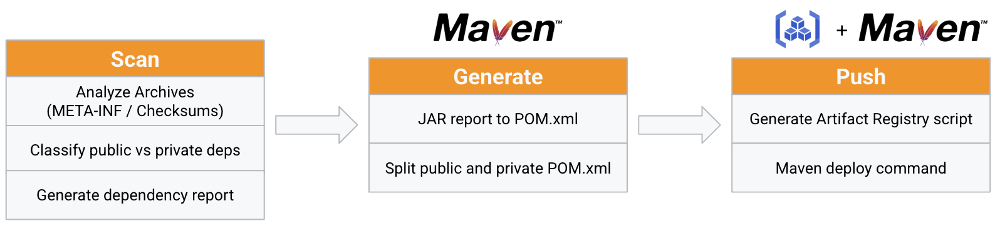

# Pomify

> Classify, manage and migrate untracked jar file dependencies into a Maven project.

[](https://opensource.org/licenses/Apache-2.0)

## Features

- [x] Scan a directory for jar files and check if they're on Maven Central or need a custom repository
- [x] Generate a status report of the jar files found in the directory
- [x] Generate pom.xml dependency blocks with the dependencies found on Maven Central and those that need a custom repository
- [x] Generate an mvn import command to migrate jar files into a custom Maven repository



More details on the approach and use case documented in [this blog post](https://medium.com/google-cloud/taming-legacy-java-dependencies-with-pomify-and-google-cloud-artifact-registry-ad528be2da9e).

## Installation

To compile from source and install, after cloning the repository, run: `make`. If you prefer to just build, run `make build`.

## Usage

```bash
NAME:
   pomify - Create Java pom.xml dependency definitions from a list of unknown jar files

USAGE:
   pomify [global options] command [command options]

VERSION:
   0.0.1

COMMANDS:
   scan, s      Scan a directory of jar files and output a CSV report
   generate, g  Generate a pom.xml dependencies block from a CSV report for each jar category
   push, p      Push the private jars to a custom Maven repository
   help, h      Shows a list of commands or help for one command

GLOBAL OPTIONS:
   --help, -h     show help
   --version, -v  print the version
```

### Scan
Scan a directory of jar files and output a CSV report

```bash
pomify scan --jars /path/to/jars --output /path/to/output.csv
```

### Generate

Generate a pom.xml dependencies block from a CSV report for each jar category

```bash
pomify generate --report /path/to/output.csv --output /path/to/output
```

### Push

Generate an mvn import command to migrate jar files into a custom Maven repository

```bash
pomify push --report /path/to/output.csv --mvn_repo http://localhost:8081/repository/maven-releases
```

**Note** Subsequent runs of pomify scan, generate, and push will overwrite the output files if they already exist. If you want to keep the output files, rename them before running the command again.
